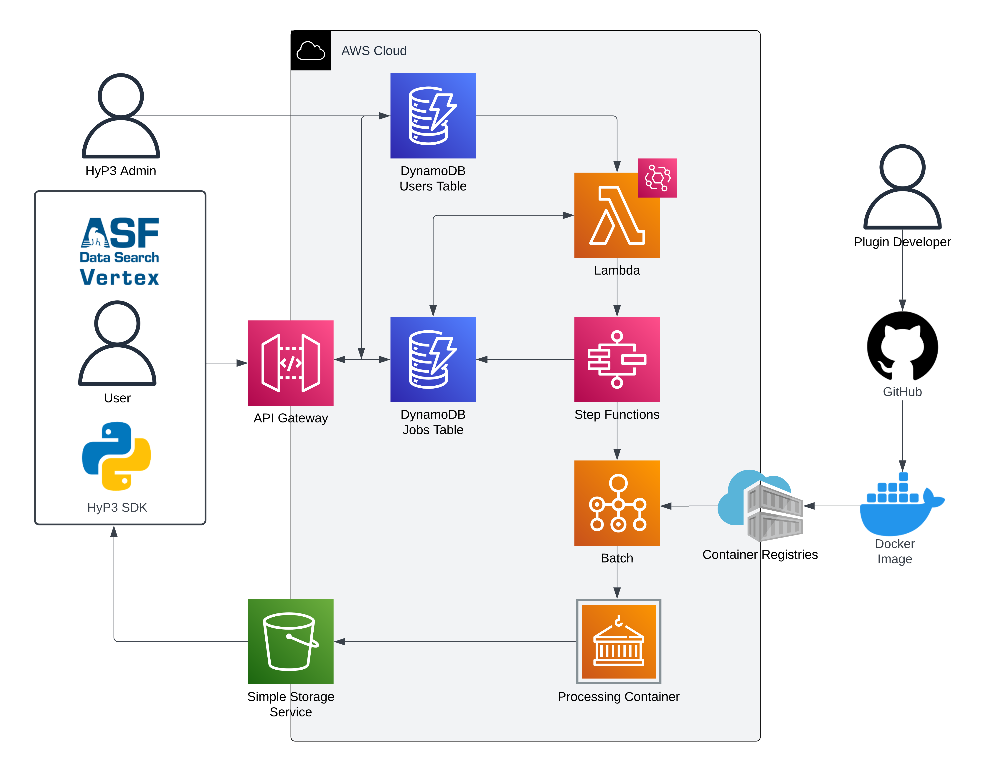
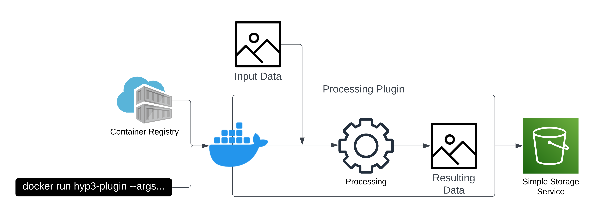

# Summary

TO DO

# Statement of need

TO DO

# HyP3 Description

## Development History
HyP3 grew out of a need for a standardized pipeline to perform image processing workflows at the Alaska Satellite Facility (ASF) Distributed Active Archive Center (DAAC). HyP3 was initially created in 2016 by a group of undergraduate students interning at ASF. These students created a prototype version of HyP3 that was designed to handle batch processing workflows running on-premises and in the AWS cloud. This prototype was iterated upon for several more years, and by 2020 it was capable of performing many SAR-specific image processing workflows.

By 2020 it was clear that re-designing HyP3 to take advantage of evolving technologies (namely the new AWS Batch service, infrastructure-as-code, and containerized workflows) would greatly improve its utility. Thus, beginning in April 2020, HyP3 was re-designed to run entirely within the AWS cloud, with processing workflows encapsulated within Docker containers. The re-design was completed in October 2020, and on-demand SAR image processing services that utilized HyP3 were made available to the public at no cost via an API, Python SDK, and Vertex, ASF's premier data search portal [link].

The first re-designed on-demand workflow made publicly available and fully integrated into Vertex was Radiometric Terrain Correction (RTC) in October 2020, with InSAR and autoRIFT, a glacier velocity tracking tool, available for programmatic users (API and SDK only). InSAR and autoRIFT were made available through Vertex in March 2021. The user base grew to XX by [date], with users producing XX image products on average every month. Since 2021, a range of users have recognized the utility of HyP3. HyP3 was deployed within NASA's Earthdata Cloud in 2022, and many other deployments of HyP3 now exist at other institutions (see the Ongoing Projects section for details), with their own custom workflows.

## HyP3 Architecture
HyP3 is a batch processing pipeline with that was built using a cloud-native serverless architecture. The design makes a clear distinction between HyP3 itself and the batch processing plugins. See Figure FF for the AWS architecture diagram.

Users can interact with HyP3 via three access methods: a graphical interface that is integrated within ASF's data search platform (Vertex), a Python software development kit (SDK), or directly via an application program interface (API). The API follows the OpenAPI specification and provides GET/POST requests for submitting job requests to HyP3, checking user information, and for checking the status of previously requested jobs. Both the SDK and graphical interface translate their inputs into API calls. The API is maintained by an API Gateway (Figure FF), and all submitted jobs are stored within a DynamoDB NoSQL database.

A scheduled EventBridge event triggers a Lambda function every 60 seconds to check the DynamoDB jobs table for newly submitted jobs and start an AWS Step Function execution for each new job. Similar to what is possible in Apache Airflow, Step Functions defines a state machine that can be used to execute the processing workflow for a particular job.

The workflow begins by inspecting the job definition for the job type. This job type will be used to determine which batch processing workflow is run and what computing resources the job needs. With this setup, a HyP3 deployment can contain an arbitrary number of different batch processing workflows. Once the memory and compute resources requirements are determined, the workflow submits the job processing via AWS Batch, which handles the scheduling of the execution and the management of resources. For HyP3, we use the AWS Elastic Container Service (ECS) inside of Batch to run the batch processing workflows within Docker containers unique to each job type. Upon successful processing, the job results are uploaded to S3. Encapsulating all processing-specific code within Docker containers with a simple interface is an important piece of the HyP3 architecture and is discussed in further detail in the Plugin Development section below. All processing workflows are run on EC2 Spot Instances to reduce the cost of batch processing.

After the processing step is complete, Step Functions check if the job was successful. If not, the job is re-submitted up to three times in order to ensure that the job did not fail due to a reclaiming of spot resources by AWS. Then, if the final run was successful the job entry in the DynamoDB table is updated so that the job status is "success" and records the location of the output products in S3. If the final run wasn't successful, the job entry in the DynamoDB table is updated so that the job status is "failed" and the log of the last failed job is uploaded to S3 and the log location is recorded in the table. At any time, the user can interact with the API and request the status of their job. Upon successful completion, this response will also include the download link to the output products which they can download for further analysis.

## Plugin Development
As mentioned previously, the processing pipeline is only loosely coupled to the plugins that contain the batch processing logic. We've found that this system provides extensibility and allows for scientists to develop batch processing plugins without having to understand the cloud architecture of the pipeline. This is enabled by relying on containerization to standardize the interface for all plugins.

To create a plugin for a specific batch processing workflow, a user begins by copying the hyp3-cookiecutter repository and using it to set up an initial project directory and "Hello World" docker container that will contain the eventual plugin. Plugin development then proceeds with writing the actual logic for batch processing. We have typically used Python to create these plugins, but other languages could be used as long as the user can create a docker container that supports them.

Once the plugin creator is satisfied with the batch processing logic, they must then create a command-line interface for the workflow within a docker container that can be called via a `docker run` command. To ensure compatibility with HyP3, the `docker run` command must accept arguments for the input datasets to process, the username/password for NASA's Earthdata login, and an S3 bucket and prefix to determine where the results should be uploaded. Once this interface is complete, the container image can be built and uploaded to either the AWS Elastic Container Registry, or the GitHub Container Registry. HyP3 can then download the container from either registry and use it to perform the requested batch processing workflow.

# Citations

TO DO 

# Figures

TO DO

# Acknowledgments

TO DO 

# References

TO DO
